# minimal_music_player

> Dự án này tham khảo từ: https://www.youtube.com/watch?v=Zr4j6W7nmpg

## Các tính năng:

> - Tuỳ chọn chế độ hiển thị "Light Mode", "Dark Mode".
> - Phát nhạc: play (pause/resume), next, previous.
> - Tự động phát bài tiếp theo khi hết bài.

## Hình ảnh:

> |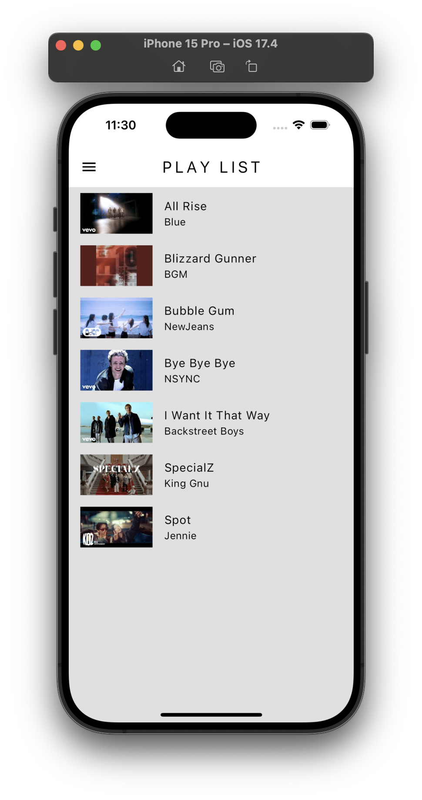|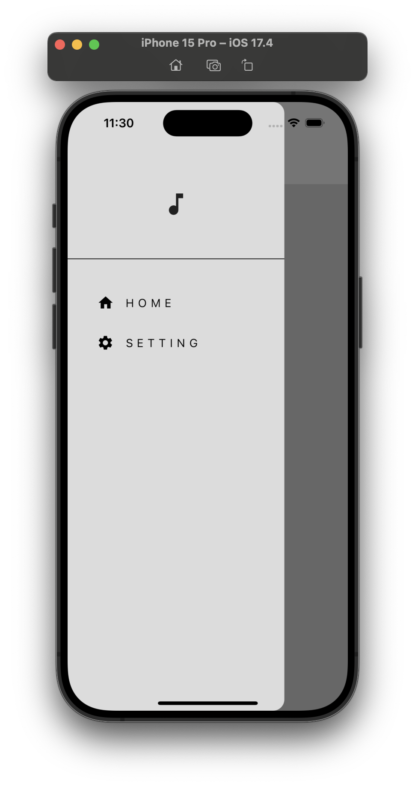|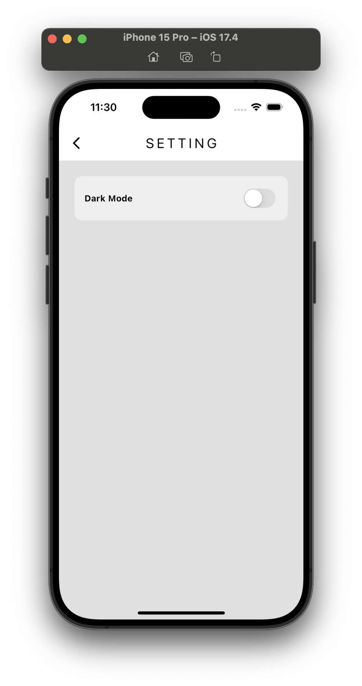|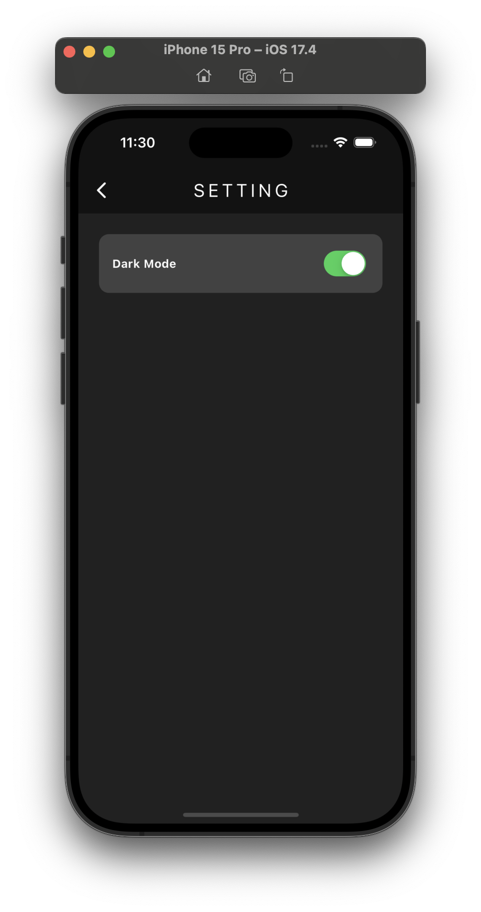|
> |-|-|-|-|
> |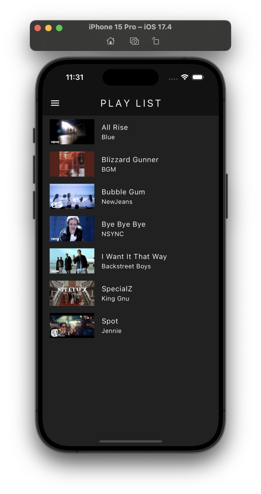|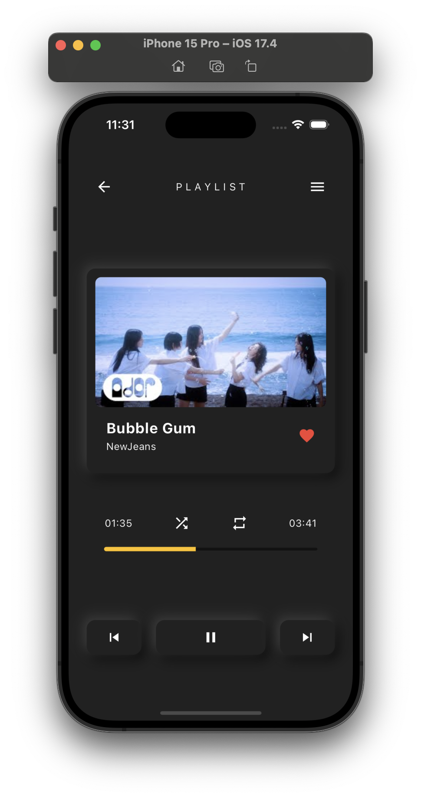||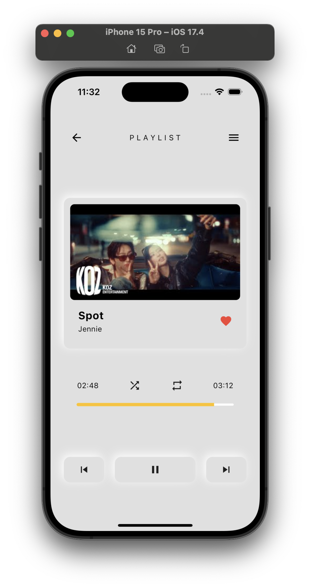|
> |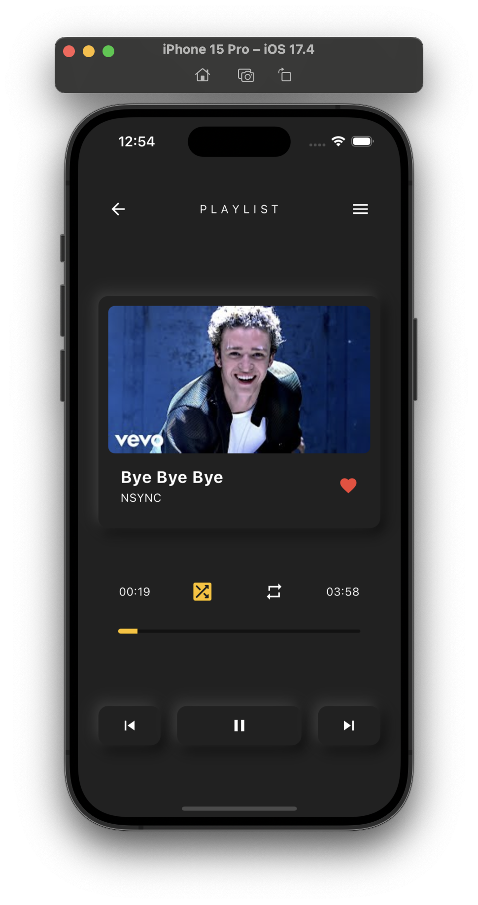|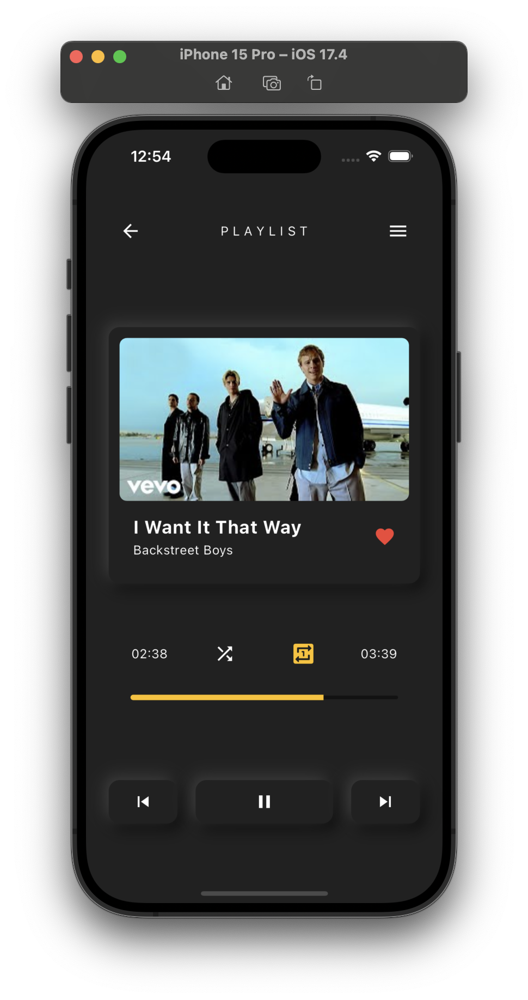|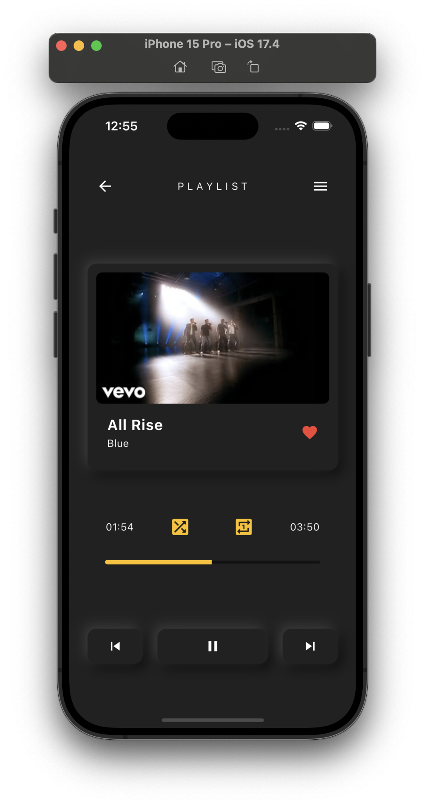|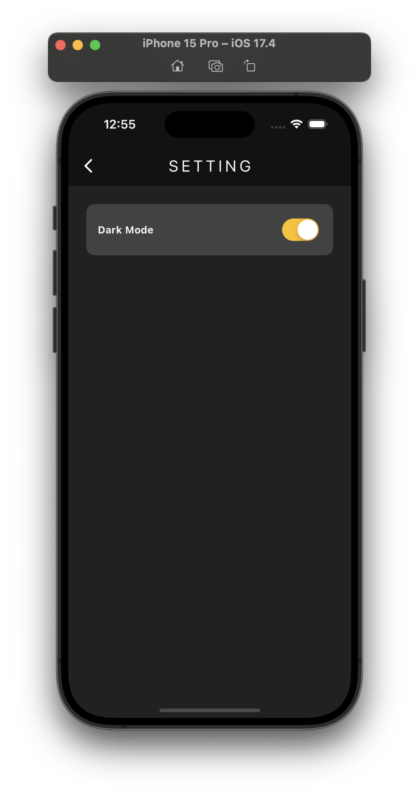|
